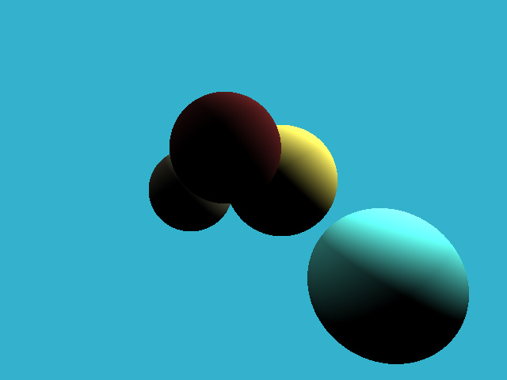
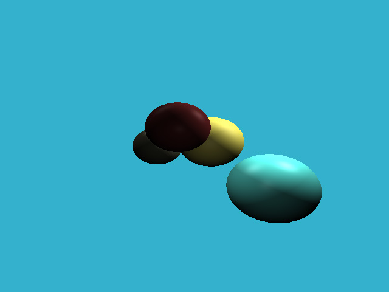
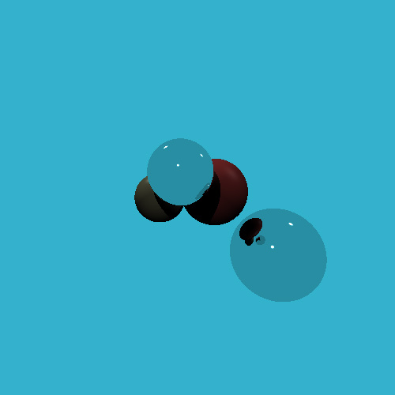

## Raytracing in C++

Basic C++ raytracing

## Dependencies

Eigen (or remove the typedefs and use built in versions)
STB

## Results

* Depth 
    
    

* Diffuse lighting
    
    

* Phong Reflection Model

    

* Shadows

    

* Reflection

    
